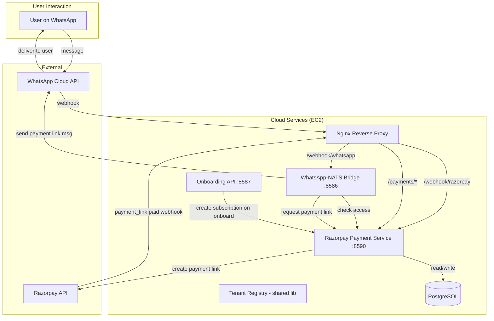
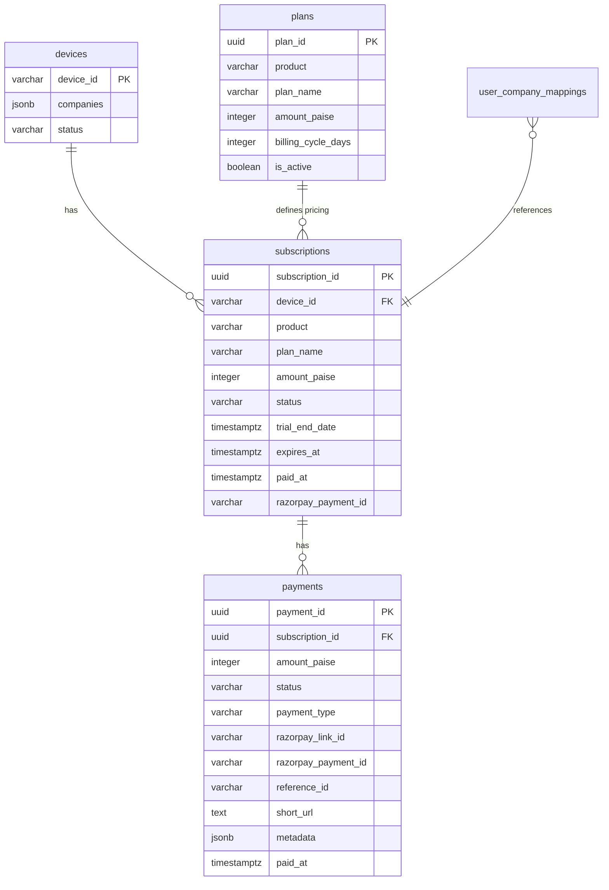

# Design Document: Global Payment Service

## Overview

The Global Payment Service is a new cloud microservice (`cloud/razorpay-service`) that provides centralized payment link generation, webhook processing, subscription lifecycle management, and access control for the Talk2Tally product ecosystem. It integrates with Razorpay Payment Links API to collect payments without a custom checkout page, and exposes REST endpoints consumed by the WhatsApp-NATS Bridge and future product services.

### Key Design Decisions

1. **Separate service, shared database**: The razorpay-service runs as its own PM2 process (port 8590) but connects to the same PostgreSQL database as tenant-registry. This avoids data duplication while maintaining service isolation.

2. **Company-based billing via device_id**: Billing is per-company (device), not per-user. The existing `subscriptions` table is extended with payment-specific fields rather than creating a parallel billing system.

3. **Razorpay Payment Links (not Subscriptions API)**: Payment Links are simpler, don't require saved payment methods, and work well with WhatsApp-native flows where users tap a link to pay.

4. **Idempotent webhook processing**: Razorpay may send duplicate webhooks. The service uses `razorpay_payment_id` as a natural idempotency key.

5. **Multi-product extensibility**: A `plans` table stores per-product pricing, and subscriptions reference a `product` field, enabling future products without schema changes.

## Architecture



### Service Communication

| Caller | Callee | Protocol | Purpose |
|--------|--------|----------|---------|
| WhatsApp-NATS Bridge | Payment Service | HTTP REST (localhost:8590) | Access check, payment link request |
| Onboarding API | Payment Service | HTTP REST (localhost:8590) | Create trial subscription on company registration |
| Razorpay | Payment Service | HTTPS webhook (via Nginx) | Payment confirmation |
| Payment Service | Razorpay API | HTTPS | Create payment links |
| Payment Service | PostgreSQL | TCP | Read/write subscriptions, payments, plans |

## Components and Interfaces

### 1. Payment Service (`cloud/razorpay-service`)

Express.js application with the following route groups:

#### Health Check
```
GET /health
Response: { status: "ok", service: "razorpay-service" }
```

#### Subscription Management
```
POST /subscriptions
  Body: { device_id, product, plan_name? }
  Response: { subscription_id, status: "trial", trial_end_date, ... }
  Purpose: Create a trial subscription for a new company

GET /subscriptions/access?device_id=X&product=Y
  Response: { status: "active"|"inactive", subscription_id?, expires_at? }
  Purpose: Check if a company has active access for a product
```

#### Payment Link Operations
```
POST /payments/create-link
  Body: { subscription_id, metadata? }
  Response: { payment_link_url, payment_link_id, expires_at }
  Purpose: Generate a Razorpay payment link for a subscription

POST /payments/create-generic-link
  Body: { amount_paise, description, reference_id, metadata?, callback_url? }
  Response: { payment_link_url, payment_link_id, expires_at }
  Purpose: Generic payment link creation (recharges, add-ons)
```

#### Webhook Handler
```
POST /webhook/razorpay
  Headers: X-Razorpay-Signature
  Body: Razorpay webhook payload
  Response: 200 OK (within 5 seconds)
  Purpose: Process payment_link.paid events
```

### 2. Database Extensions (via tenant-registry shared pool)

The service uses the same PostgreSQL connection pool as other services. New tables are added via migration SQL.

### 3. Integration Points

**WhatsApp-NATS Bridge modifications:**
- Before routing a question, call `GET /subscriptions/access?device_id=X&product=talk2tally`
- If `inactive`, call `POST /payments/create-link` with the subscription_id
- Send the returned payment link URL to the user via WhatsApp

**Onboarding API modifications:**
- After `POST /onboard/select-company` creates a subscription, call `POST /subscriptions` on the payment service to initialize a trial subscription with proper product and plan fields.

### 4. Subscription Expiry Worker

A lightweight cron-style function (using `setInterval` or node-cron) that runs every hour within the razorpay-service process:
- Queries subscriptions where `status = 'trial' AND trial_end_date < NOW()`
- Transitions them to `status = 'expired'`
- Queries subscriptions where `status = 'active' AND expires_at < NOW()`
- Transitions them to `status = 'expired'`

## Data Models

### Extended `subscriptions` Table

```sql
-- Migration: Extend existing subscriptions table for payment service
ALTER TABLE subscriptions
  ADD COLUMN IF NOT EXISTS product VARCHAR(50) NOT NULL DEFAULT 'talk2tally',
  ADD COLUMN IF NOT EXISTS amount_paise INTEGER,
  ADD COLUMN IF NOT EXISTS billing_cycle_days INTEGER DEFAULT 30,
  ADD COLUMN IF NOT EXISTS trial_end_date TIMESTAMPTZ,
  ADD COLUMN IF NOT EXISTS paid_at TIMESTAMPTZ,
  ADD COLUMN IF NOT EXISTS razorpay_payment_id VARCHAR(255),
  ADD COLUMN IF NOT EXISTS payment_link_id VARCHAR(255),
  ADD COLUMN IF NOT EXISTS payment_link_url TEXT,
  ADD COLUMN IF NOT EXISTS payment_link_expires_at TIMESTAMPTZ;

-- Add product to unique constraint (one subscription per device per product)
CREATE UNIQUE INDEX IF NOT EXISTS idx_subscriptions_device_product
  ON subscriptions (device_id, product);

-- Update status check to include 'trial'
ALTER TABLE subscriptions
  DROP CONSTRAINT IF EXISTS subscriptions_status_check;
ALTER TABLE subscriptions
  ADD CONSTRAINT subscriptions_status_check
  CHECK (status IN ('trial', 'active', 'expired', 'cancelled'));
```

### New `plans` Table

```sql
CREATE TABLE IF NOT EXISTS plans (
    plan_id         UUID PRIMARY KEY DEFAULT gen_random_uuid(),
    product         VARCHAR(50) NOT NULL,
    plan_name       VARCHAR(100) NOT NULL,
    amount_paise    INTEGER NOT NULL,
    billing_cycle_days INTEGER NOT NULL DEFAULT 30,
    description     TEXT,
    is_active       BOOLEAN NOT NULL DEFAULT true,
    created_at      TIMESTAMPTZ NOT NULL DEFAULT NOW()
);

-- Seed default plan
INSERT INTO plans (product, plan_name, amount_paise, billing_cycle_days, description)
VALUES ('talk2tally', 'monthly', 100000, 30, 'Talk2Tally Monthly - ₹1,000/month')
ON CONFLICT DO NOTHING;
```

### New `payments` Table

```sql
CREATE TABLE IF NOT EXISTS payments (
    payment_id              UUID PRIMARY KEY DEFAULT gen_random_uuid(),
    subscription_id         UUID NOT NULL REFERENCES subscriptions(subscription_id),
    amount_paise            INTEGER NOT NULL,
    currency                VARCHAR(10) NOT NULL DEFAULT 'INR',
    status                  VARCHAR(20) NOT NULL CHECK (status IN ('pending', 'captured', 'expired', 'failed')),
    payment_type            VARCHAR(20) NOT NULL DEFAULT 'subscription' CHECK (payment_type IN ('subscription', 'recharge', 'addon', 'upgrade')),
    razorpay_link_id        VARCHAR(255),
    razorpay_payment_id     VARCHAR(255),
    reference_id            VARCHAR(255),
    short_url               TEXT,
    metadata                JSONB DEFAULT '{}',
    created_at              TIMESTAMPTZ NOT NULL DEFAULT NOW(),
    paid_at                 TIMESTAMPTZ,
    expires_at              TIMESTAMPTZ
);

-- Index for webhook lookup by reference_id
CREATE INDEX IF NOT EXISTS idx_payments_reference_id ON payments (reference_id);

-- Index for idempotency check
CREATE UNIQUE INDEX IF NOT EXISTS idx_payments_razorpay_payment_id
  ON payments (razorpay_payment_id) WHERE razorpay_payment_id IS NOT NULL;
```

### Entity Relationships




## Correctness Properties

*A property is a characteristic or behavior that should hold true across all valid executions of a system—essentially, a formal statement about what the system should do. Properties serve as the bridge between human-readable specifications and machine-verifiable correctness guarantees.*

### Property 1: Trial subscription creation preserves plan configuration

*For any* valid device_id and product with a corresponding plan in the database, creating a trial subscription SHALL produce a record with status "trial", trial_end_date exactly 7 days from creation, and amount_paise/billing_cycle_days/plan_name matching the plan's configured values.

**Validates: Requirements 1.1, 1.3, 1.4**

### Property 2: Multi-product subscription isolation

*For any* device_id and set of distinct product identifiers, creating one subscription per product SHALL succeed independently, and each subscription SHALL be retrievable by the (device_id, product) pair without affecting other subscriptions for the same device.

**Validates: Requirements 1.2, 7.2**

### Property 3: Access status derivation from subscription state

*For any* subscription record, the access check SHALL return "active" if and only if the subscription status is "trial" with trial_end_date in the future, OR status is "active" with expires_at in the future (or NULL). For all other states (expired, cancelled, or past dates), the access check SHALL return "inactive". This evaluation SHALL be independent per product for the same device.

**Validates: Requirements 2.1, 2.3, 7.3**

### Property 4: Subscription expiry transitions

*For any* subscription with status "trial" and trial_end_date in the past (with no razorpay_payment_id), OR status "active" and expires_at in the past, the expiry worker SHALL transition the status to "expired" and leave all other subscriptions unchanged.

**Validates: Requirements 2.2, 9.1**

### Property 5: Payment link request construction

*For any* subscription with a valid amount_paise, company name, and product, creating a payment link SHALL produce a Razorpay API request containing: the exact amount_paise, currency "INR", a description containing the company name and product, a reference_id equal to the subscription_id, and an expire_by timestamp approximately 24 hours from creation.

**Validates: Requirements 3.2, 4.2, 4.3**

### Property 6: Payment link persistence round-trip

*For any* successful payment link creation, the service SHALL store a payment record with the razorpay_link_id, short_url, subscription_id, amount_paise, status "pending", and created_at timestamp, such that querying by subscription_id returns the same values.

**Validates: Requirements 4.4, 8.1**

### Property 7: Payment link idempotency

*For any* subscription that already has a non-expired payment link, requesting a new payment link SHALL return the existing link's short_url and SHALL NOT create a new Razorpay payment link or a new payment record.

**Validates: Requirements 4.5**

### Property 8: Webhook signature validation

*For any* request body and webhook secret, the signature validation function SHALL accept the request if and only if the X-Razorpay-Signature header equals the HMAC-SHA256 of the raw request body using the webhook secret as key.

**Validates: Requirements 5.2**

### Property 9: Webhook payload extraction

*For any* valid `payment_link.paid` webhook payload containing a reference_id and payment details (payment_id, amount), the extraction function SHALL correctly parse and return the reference_id (subscription_id), razorpay_payment_id, and amount_paise from the nested payload structure.

**Validates: Requirements 5.4**

### Property 10: Payment confirmation state transition

*For any* valid payment event processed against a subscription, the service SHALL update the subscription status to "active", set paid_at to the payment timestamp, store the razorpay_payment_id, set expires_at to paid_at + billing_cycle_days, AND update the corresponding payment record status to "captured" with the razorpay_payment_id and paid_at.

**Validates: Requirements 5.5, 8.2**

### Property 11: Webhook idempotency

*For any* payment event, processing it N times (N ≥ 1) SHALL produce the same database state as processing it exactly once: one payment record with status "captured", one subscription with status "active", and no duplicate records.

**Validates: Requirements 5.7**

### Property 12: Payment record expiry

*For any* payment record with status "pending" and expires_at in the past, the expiry worker SHALL transition the payment status to "expired" without affecting the associated subscription status or other payment records.

**Validates: Requirements 8.4**

### Property 13: Payment metadata and type passthrough

*For any* valid JSON metadata object and valid payment_type value ("subscription", "recharge", "addon", "upgrade"), creating a payment link with these fields SHALL store them in the payment record such that they are retrievable unchanged.

**Validates: Requirements 10.1, 10.2**

## Error Handling

### Razorpay API Errors

| Error Scenario | Handling |
|---|---|
| Razorpay API timeout (>10s) | Return 503 to caller with `{ error: "payment_provider_timeout" }`. Log full error. |
| Razorpay 4xx (bad request) | Return 400 to caller with sanitized error message. Log full Razorpay response. |
| Razorpay 5xx (server error) | Return 503 to caller with `{ error: "payment_provider_unavailable" }`. Log and alert. |
| Rate limited by Razorpay | Return 429 to caller. Implement exponential backoff for retries. |

### Webhook Errors

| Error Scenario | Handling |
|---|---|
| Invalid signature | Return 401 immediately. Do not process payload. Log attempt with IP. |
| Malformed payload (missing fields) | Return 200 (to prevent Razorpay retries) but log error and skip processing. |
| Subscription not found for reference_id | Return 200, log warning. Payment may be for a deleted/unknown subscription. |
| Database write failure during webhook | Return 500 (Razorpay will retry). Log error with full context for manual recovery. |
| Duplicate payment_id (idempotency) | Return 200 silently. No error — this is expected behavior. |

### Access Check Errors

| Error Scenario | Handling |
|---|---|
| Device not found | Return `{ status: "inactive" }` — fail closed. Log warning. |
| Database connection failure | Return 503 with `{ error: "service_unavailable" }`. WhatsApp Bridge should send a "try again later" message. |
| Missing product parameter | Return 400 with `{ error: "product parameter required" }`. |

### Payment Link Creation Errors

| Error Scenario | Handling |
|---|---|
| Subscription not found | Return 404 with `{ error: "subscription_not_found" }`. |
| Subscription already active (not expired) | Return 400 with `{ error: "subscription_already_active" }`. No payment needed. |
| Plan not found for product | Return 500 with `{ error: "plan_configuration_missing" }`. Alert operator. |

## Testing Strategy

### Property-Based Tests (fast-check)

The project already uses `fast-check` (see `cloud/tenant-registry/package.json`). The razorpay-service will use the same library.

**Configuration:**
- Minimum 100 iterations per property test
- Each test tagged with: `Feature: global-payment-service, Property {N}: {title}`
- Tests run via `npm test` (Jest + fast-check)

**Property tests cover:**
- Subscription creation logic (Properties 1, 2)
- Access status derivation (Property 3)
- Expiry transitions (Properties 4, 12)
- Payment link construction and idempotency (Properties 5, 6, 7)
- Webhook signature validation (Property 8)
- Webhook payload extraction (Property 9)
- Payment confirmation transitions (Properties 10, 11)
- Metadata/type passthrough (Property 13)

### Unit Tests (Jest)

Unit tests cover specific examples and edge cases not suited for property testing:

- Endpoint existence and response shapes (smoke tests)
- Error responses for invalid inputs (400, 404 responses)
- Razorpay API error handling (timeout, 4xx, 5xx)
- WhatsApp Bridge integration behavior (mocked)
- Expiry worker scheduling (setInterval setup)
- Nginx routing configuration for `/webhook/razorpay`

### Integration Tests

- End-to-end payment flow: create subscription → expire trial → request link → webhook → access restored
- WhatsApp Bridge + Payment Service interaction (both services running)
- Database migration verification (schema changes apply cleanly)

### Test Dependencies

```json
{
  "devDependencies": {
    "jest": "^29.7.0",
    "fast-check": "^3.23.2",
    "nock": "^13.5.0"
  }
}
```

- **jest**: Test runner (consistent with other cloud services)
- **fast-check**: Property-based testing library (already used in tenant-registry)
- **nock**: HTTP mocking for Razorpay API calls
